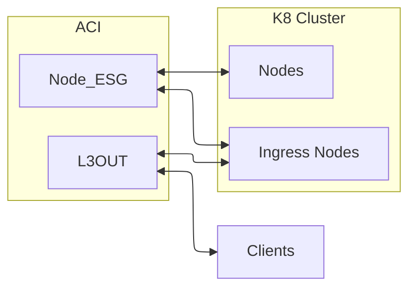

# ACI K8S and Ansible Driven Automation -- WORK IN PROGRESS

This GitRepo contains a demo to show how we can leverage the power of Cisco ACI Fabric, Kubernetes and Red Hat Ansible's event-driven automation to dynamically program the ACI fabric.
Our goal is to efficiently expose a Kubernetes LoadBalancer Service IP, illustrating how these technologies can work in tandem to enhance network agility and responsiveness.
Cisco ACI provides a robust and scalable network infrastructure that simplifies complex data center operations. By integrating it with Kubernetes, the leading container orchestration platform, we can automate the management of network resources to support dynamic application needs.
Additionally, with Red Hat Ansible's event-driven automation, we can respond to changes and events in real-time, ensuring that our network configuration aligns seamlessly with the evolving demands of our Kubernetes environment.
Throughout this demo, we will walk through the process of setting up this integration, demonstrate how event-driven automation can trigger network changes, and showcase the resulting efficiency and flexibility in managing Kubernetes services.

# Prerequisites

In case you want to replicate this workflow in your lab you will need the following in place:

* Cisco ACI Fabric Configuration:
    * The ACI fabric is pre-configured with the Kubernetes nodes placed in an Endpoint Security Group (ESG) to facilitate seamless cluster communication.
    * A subset of these Kubernetes nodes are peering with the ACI fabric via BGP, connecting to an L3out named "services" to enable external routing capabilities for the exposed services
	* A Contract to provide connectivity from your L3OUT External EPGs to the Client accessing the services 
* Software Installations:
    * ArgoCD: Ensure that ArgoCD is installed and operational. This will be crucial for managing and deploying applications to the Kubernetes cluster in a GitOps fashion.
	* Red Hat Ansible Automation Platform: The platform should be installed and ready to use, enabling us to leverage event-driven automation for efficient network and service management.

## ACI Logical Topology 



# Automation Architecture

## Components 

* Operator: The person or system that initiates the process by committing code into a Git repository.
* Git Repository: The repository where the code is stored. When the operator commits code, it triggers the next steps.
* ArgoCD: A continuous delivery tool for Kubernetes. It detects changes in the Git repository and deploy the changes inside the K8s Cluster.
* K8s Application: Represents the Kubernetes application managed by ArgoCD.
* Ansible Automation Platform: A platform for automating IT tasks.
* Rule Book Activation: A set of rules that define when certain actions should be taken.
* Job Template: A template that defines how a job should be executed.
* Job: The actual task or set of tasks that are executed.

```mermaid
    flowchart-elk LR
        O["Operator"]
        GR["Git Repo"]
        subgraph ArgoCD
            KA["K8s Application"]
        end
        subgraph Ansible Automation Platform
            RBA["Rule Book Activation"]
            JT["Job Template"]
            J["Job"]
            RBA -- "Invoke Job Template" --> JT
            JT -- "Triggers Ansible Playbook" --> J
        end
        O -- "Commit Code Into Git" --> GR
        GR -- "Argo Detect Change in Git Repo" --> KA
        KA -- "Webhook Call, Pass Application Context" --> RBA
        J -- "Update ExtEPG Config" --> APIC
```




## Workflow:

* The Operator commits code into the Git Repository.
* ArgoCD detects the change in the Git Repository and updates the K8s Application.
* The K8s Application triggers a webhook call, passing the application context to the Rule Book Activation in the Ansible Automation Platform.
* The Rule Book Activation invokes the Job Template (passing the application context).
* The Job Template triggers an Ansible playbook, which executes the Job.
    * The Job add/remove external EPGs from ACI

# Configuration Details

## Kubernetes:

My Kubernetes Cluster, for this demo, is composed of:
- 3 Control Plane Nodes running as VMs inside OpenShift
- 2 Ingress Nodes running as VMs inside OpenShift
- 3 Raspberry Pi 4

Running [Talos Linux ](https://www.talos.dev/). If you are reading this guide I do expect you to be able to deploy a K8s Cluster. 

Ansible (see later) needs to connect to this cluster to gather information about the services. To do so I have created a [service account](k8s/rbac/service-reader.yml) that can read the services in any namespace.
Once the service account is created you can verify that has the right permission with this command:

```shell
kubectl auth can-i get services --as=system:serviceaccount:default:service-reader                                                                                            
yes
kubectl auth can-i get pod --as=system:serviceaccount:default:service-reader                                                                                            
no
```

If the above is correct you can then create a "token" that can be used to access the cluster. You have to set an expiration date for the token. If is a lab just set something like 10y

```shell
kubectl create token service-reader --duration=8760h
```

## Ansible Automation Platform
I installed `Ansible Automation Platform` in my `OpenShift` cluster using the `OperatorHub`. Once Ansible Automation Platform is installed we need to:

* (Optional) Configure Proxy: `Settings` --> `Jobs` --> `Edit` --> Set the `no_proxy`, `http_proxy` and `https_proxy` in the `Extra Environment Variables` these will be passed to all the Jobs and will ensure you can connect to github etc...

### Set up Event Driven Automation (EDA):

* Credentials: We need to configure 2 credentials:
    * Credentials for ArgoCD Webhooks: This are used by ArgoCD to authenticate with Ansible EDA.
        * Type: Basic Event Stream
        * Org: Default
        * User/Pass: Up to you
    * Credentials for Ansible Automation Platform : This are used by Ansible EDA to connect to Ansible Automation Platform
        * Type: Red Hat Ansible Automation Platform
        * Org: Default
        * User/Pass: The credentials you used to log in to the UI of Ansible Automation Platform will do just fine for a lab. 

* Create an Event Stream: 
    * Type: Basic Event Stream (This means Basic Authentication)
    * Credential: The credentials for ArgoCD
    
    Notes: 
    * Once the Event Stream is created it will generate a `url` this will be used as the webhook URL in `ArgoCD`
    * Debug Top Tip: Disable `Forward events to rulebook activation` to visualize on the UI the data `ArgCD` is sending to the Even Stream. 

* Create a Decision Environment: 
    * Image: quay.io/ansible/ansible-rulebook:v1.1.2
    * Org: Default

* Create a Rule Book In your Git Repo: In this lab we are using the [external_epgs.yaml](extensions/eda/rulebooks/external_epgs.yaml) rule book. The rule books MUST be placed under the `extensions/eda/rulebooks/` path in the GitRepo. 

This rule book is configured to: 
* be triggered by the `condition: event.meta.eda_event_stream_name == 'argocd'`
* Start a Job from the `ManageExtEPGs` Job Template (that we will configure later)
* Pass to the Job Template the `extra_vars`: `namespace: "{{ event.payload.namespace }}"`
    * `event.payload` is the HTTP Body Of the ArgoCD Webhook. If you check the ArgoCD section you will see that the body is poulated with
    ```yaml
        body: |
        {
            "name": "{{.app.metadata.name}}",
            "namespace": "{{.app.spec.destination.namespace}}",
        }
    ```

* Create a Project Using the `Rule Book`:
    * Name: A name
    * Source control URL: Your Git Repo
    * Source control branch/tag/commit: main (or what you want to use)
    * (Optional) Proxy: Set a proxy if needed 

* Create a Rule Book Activation:
    * Name: A name
    * Project: The project you created in the previous step
    * Rulebook: `external_epgs.yaml` this should be an auto populated drop down menu. The data comes directly from Git
    * Event streams: Click on the cog and you should be able to map the rule book `source.name` variable with the `Event Stream` configured in the UI
    * Credential: Select the Credentials for the Ansible Automation Platform.
    * Decision environment: Default

Note: Every time you change the Status of the GitRepo you need to Sync the Project for the `external_epgs.yaml` rule book to be updated locally. 

### Set up Automation Execution:

* Create a new execution Environment Container: For this workflow I am using the `kubernetes.core` galaxy collection and it requires the `kubernetes` python library. This library is not available in the standard execution environment. To build one you can use the `ansible-builder` pip package and this [Config](execution-environment/builder/execution-environment.yml).
    * This step MUST be done on a RHEL machine registered to subscription manager or the `openshift-client` installation will fail. (this is a dependency of the `kubernetes` python library)
    * Push the image to a Container Registry
    ```shell
    ansible-builder build -v3 --build-arg HTTPS_PROXY="http://proxy:80" -t harbor.cam.ciscolabs.com/library/custom-ee:latest
    podman push harbor.cam.ciscolabs.com/library/custom-ee --tls-verify=false
    ```
* Create the required Credentials:
    * ACI: For this I create a simple `Network` type credentials that uses username and password.
        * Name: A name
        * Organization: Default 
        * Credential type: Network
        * Username: Your User Name
        * Password: Your Password
        * Note: The credentials can be accessed from the playbook by using the following environment variables:  `ANSIBLE_NET_USERNAME` and `ANSIBLE_NET_PASSWORD`
    * K8s: For this we can use the `OpenShift or Kubernetes API Bearer Token`
        * Name: A name
        * Organization: Default 
        * Credential type: OpenShift or Kubernetes API Bearer Token
        * OpenShift or Kubernetes API Endpoint: Your API URL Endpoint
        * API authentication bearer token: The Token we generated before
        * Note: The credentials can be accessed from the playbook by using the following environment variables: `K8S_AUTH_API_KEY` `K8S_AUTH_HOST` and `K8S_AUTH_VERIFY_SSL` this is currently not documented in OpenShift but I opened an ticket with them to have the config guide updated. 

* Create the `Inventory` and `Hosts`: We will need an inventory containing both the `APIC` and `K8s API` Endpoints. For example I have an inventory called `cilium-bgp-1-infra` that contains 2 hosts: `cilium-bgp-1.cam.ciscolabs.com` and `inb-fab2-apic1.cam.ciscolabs.com`

* Create the Ansible Playbook: For this automation workflow I am using the [k8s_svc](aci/k8s_svc.yaml) playbook. This playbook does the following:
    * Kubernetes Tasks:
        * Get a list of all service objects from K8s that are part of my Application Namespace and of type `LoadBalancer`
        * Create a dictionary that uses as key the <namespace>_<service_name> and as value the service IP
    * ACI Tasks:
        * Get the current state of the L3Out
        * Create a list of the extEPG  names currently in the L3Out
        * Calculate which extEPG needs to be added and which needs to be removed
        * If an extEPG is missing add it
        * Update the extEPG Subnet
        * Update the extEPG Contract (currently the contract name is hard coded)
        * Delate ExtEpg that are not anymore needed

* Create a Project Using the Ansible Playbook:
    * Name: A name
    * Organization: Default
    * Execution environment: The execution environment we created
    * Source control type: Git
    * Source control URL: Your Git Repo
    * Source control branch/tag/commit: main (or what you want to use)

* Create job template:
    * Name: A name
    * Job type: Run
    * Inventory: Our inventory
    * Project: Our Project
    * Playbook: `aci/k8s_svc.yaml`
    * (Optional) Execution environment: The execution environment we created, this should not be needed if you have set it already in the Job
    * Credentials: Select the ACI and K8s credentials
    * Extra variables: This is **very important**: In order to receive the Event Driven Automation variables (the namespace name) you need to enable `Prompt on launch` or the variable will not be set.
        * I also set here `aci_validate_certs: 'no'` but this could be set also in other places.

Note: Every time you change the Status of the GitRepo you need to Sync the Project for the `k8s_svc.yaml` play book to be updated locally. 


## ArgoCD 

I installed `ArgoCD` in my `OpenShift` cluster using the `OperatorHub`. Once ArgoCD is installed we need to connect it to the K8s cluster.
This can be done by using the `argocd cluster add` command.

```
export KUBECONFIG=<kubeconfig>
kubectl config get-contexts
CURRENT   NAME                 CLUSTER        AUTHINFO             NAMESPACE
*         *dmin@cilium-bgp-1   cilium-bgp-1   admin@cilium-bgp-1   egress-1
argocd cluster add admin@cilium-bgp-1  # This needs to match the NAME of the get-contexts output
```

Once the cluster is added we need to Configure the Notification Settings for Ansible.
In OpenShift his is done by editing the `NotificationsConfiguration` and defying the following items:

* A `Trigger` to define when to invoke a Template, in this demo we are are using the pre-existing `trigger.on-sync-succeeded`

```yaml 
  triggers:
    trigger.on-sync-succeeded: |-
      - description: Application syncing has succeeded
        send:
        - app-sync-succeeded
        when: app.status.operationState.phase in ['Succeeded']
```

* A `Template` to define what to do when `trigger.on-sync-succeeded` is fired. The default configuration already contains a `template.app-sync-succeeded` that we need to extend with an extra entry:
```yaml
    template.app-sync-succeeded: |-
        webhook:
            eda:
                method: POST
                body: |
                {
                    "name": "{{.app.metadata.name}}",
                    "namespace": "{{.app.spec.destination.namespace}}",
                }
```
* A `Service` to define where to send data

```yaml
spec:
  services:
    service.webhook.eda: |
      url: <Ansible EDA Webhook>
      basicAuth:
        username: <User>
        password: <Pass>
      insecureSkipVerify: true
```

# Demo

With all the components now set up, we are ready to deploy applications and seamlessly add or remove Services of Type LoadBalancer. The Cisco ACI fabric will automatically adjust its configuration to accommodate these changes, demonstrating the power of our integrated system.

This demonstration is designed to be straightforward, focusing on exposing services to my Lab Network. However, the true potential lies in the flexibility of this setup. By modifying the playbook, it can be easily adapted to support more complex use cases, such as integrating with production environments or implementing advanced network policies.

This demo serves as a foundation for exploring the extensive capabilities of these technologies, providing a glimpse into how they can be tailored to meet diverse operational needs.

<video controls src="demo/demo.mp4" title="Unified GitOps and NetOps with ACI, K8s, Ansible and ArgoCD"></video>